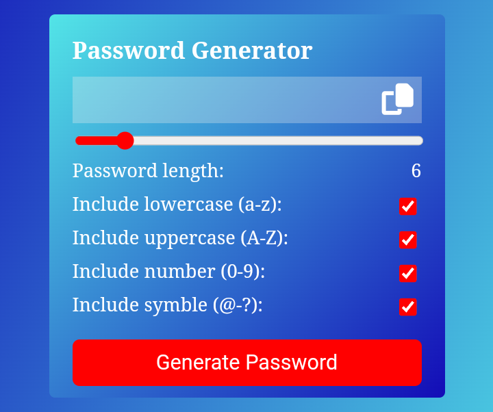

# Random Password Generator

The Random Password Generator is a web application that allows users to generate random passwords with customizable options. Users can choose the length of the password, select whether to include numbers, uppercase letters, lowercase letters, and symbols, providing flexibility and security when creating passwords.

## Features

- Generate random passwords with customizable options
- Choose the length of the password
- Include or exclude numbers, uppercase letters, lowercase letters, and symbols
- Copy the generated password to the clipboard
- Responsive design for desktop and mobile devices

## Demo

You can try out the Random Password Generator in the live demo [here](https://laxmanroy52.github.io/random-password-generator/).

## Installation

To install and run the Random Password Generator locally, follow these steps:

1. Clone the repository: `gh repo clone laxmanroy52/random-password-generator`
2. Navigate to the project directory: `cd random-password-generator`
3. Open `index.html` in your preferred web browser

## Usage

1. Set the desired options for your password:
   - Choose the length of the password (e.g., 8 characters, 12 characters, etc.)
   - Select the checkboxes for including numbers, uppercase letters, lowercase letters, and symbols.
2. Click the "Generate Password" button.
3. The generated password will be displayed in the designated area.
4. Click the "Copy" button to copy the password to your clipboard.

## Acknowledgements

The Random Password Generator was inspired by various password-related tools and resources available online. Special thanks to the open-source community for their contributions and references.

## Contact

If you have any questions or feedback, feel free to reach out:

- Email: luxmanroyluxman@gmail.com

---

Thank you for your interest in the Random Password Generator! We hope it helps you generate secure passwords and enhance your online security.
